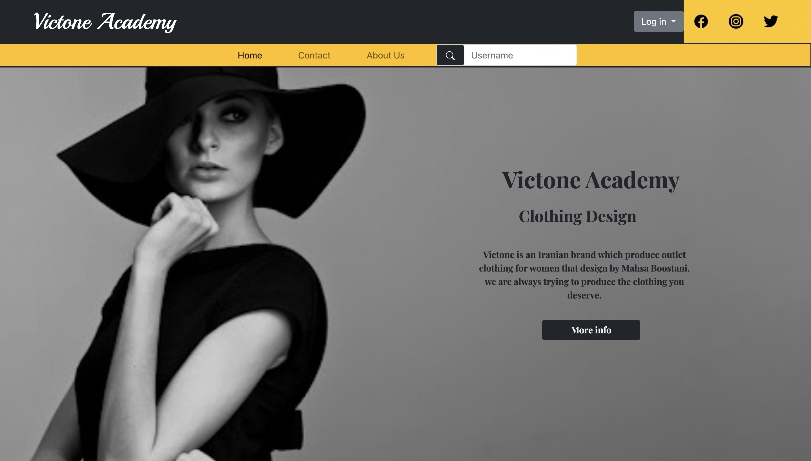

# Fashion Academy
This website is a sample project for a fashion academy.  
It uses these technologies:

- HTML
- CSS
- Bootstrap

Also this project has a Q/A game for more information about fashion.

## Design
I have designed this website with figma, you can see it [here](https://www.figma.com/file/0hiRX2vABNnxm8dhbxpfmJ/Untitled)

## Server
This project is using Mockoon to test requests. If you want to test it you can import this [file](fashion-academy-server.json).  
For more information and how to use Mockoon, please check [this](https://mockoon.com/docs/latest/about/).
## Run
You can just open `index.html` in your browser
## Preview
